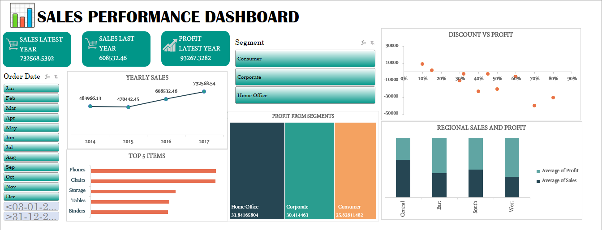

# 📊 Superstore Sales Dashboard

Welcome to my first professional Sales Dashboard project using the popular *Superstore* dataset! This dashboard was created to analyze sales performance, identify trends, and derive actionable insights for business decisions.

---

## 📁 File Included

- `Superstore new(reco).xlsx`: Contains the cleaned dataset, pivot tables, charts, slicers, and KPI summaries used for visualizing sales trends across different categories, regions, and time periods.

---

## 🎯 Purpose of this Dashboard

The main objectives of this dashboard are:

- To explore sales, profit, and quantity metrics across various dimensions.
- To enable interactive filtering using slicers.
- To highlight top-performing and underperforming categories and regions.
- To develop skills in Excel-based data analysis and visualization.

---

## 📈 Key Features

- **KPI Summary**: At-a-glance metrics for total sales, profit, and quantity.
- **Interactive Slicers**: For filtering data by segment, category, and region.
- **Charts & Graphs**: Bar charts, line graphs, and pie charts for a visual summary.
- **Top 5 Analysis**: Highlighting top products and sub-categories driving sales.

---

## 👩👜 Role as a Data Analyst

As a beginner data analyst, this project helped me:

- Strengthen my skills in Excel (PivotTables, formulas, and visual design).
- Understand data cleaning and organizing raw data into usable formats.
- Practice presenting insights in a clean and effective dashboard layout.

---

## 📌 Why Visualization Matters

Data visualization bridges the gap between raw data and decision-making. A well-structured dashboard:

- Helps stakeholders understand key performance drivers.
- Supports faster decision-making with visual cues.
- Simplifies complex datasets into digestible charts.

---

## 🚀 Future Improvements

- Add advanced KPIs like YoY growth or customer lifetime value.
- Convert this dashboard to Power BI for more interactivity.

---

## 🛠 Tools Used

- Microsoft Excel
- Pivot Tables and Charts
- Data Cleaning Techniques

---

## 🖼️ Dashboard Preview

---

## 📬 Connect With Me

If you're a recruiter, mentor, or fellow data enthusiast, I'd love to connect!

- 🔗 [LinkedIn Profile](#www.linkedin.com/in/cheshta-grover-7ba10a291)
- 💼 Open to internship and freelance opportunities in Data Analysis.

---

